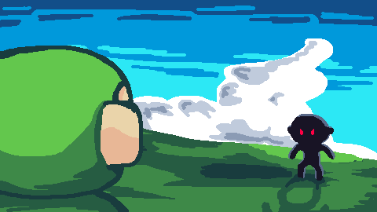

# "GAME"

This game doesn't even have a name yet.

My first game built in [Godot Engine](http://godotengine.org/ "Godot Engine").
I'm using this project to learn GDScript language and game developing.

Functioning game and changelogs can be found in [Releases](https://github.com/vuxnq/game/releases "Releases").